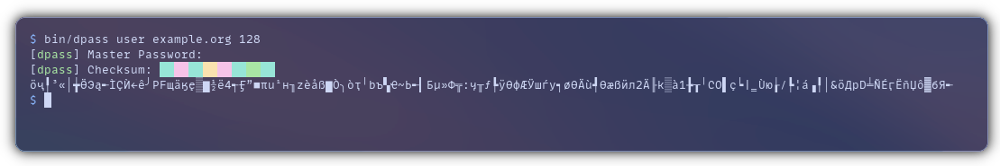

<h1 align="center">
 
</h1>
</p>

***dpass*** is a password generator and "manager" that uses a plain text input, like a **username** and **website** to make a <sub><sup><i>theoretically</i></sup></sub> uncrackable password.

It doesn't behave like a traditional password manager that generates random passwords and stores them in an encrypted file, which is obviously **susceptible to data loss**, instead it generates a **pseudorandom** password using your input data as a seed, and secures it with a master password.

>**[tl;dr]:** It makes passwords in a reproducible way, so you can get your passwords without saving them.

# Features
* Zero data stored anywhere, so you can't lose your passwords
* Small, only 60kb binary
* Aside from standard *NIX headers, zero dependencies
* Pretty secure
# Usage

<p align="center">
  <br>
  
</p>


# Installation
>[!IMPORTANT]
> To run `dpass` on Windows, install WSL2 by running `wsl --install` in Powershell, then in WSL continue from Linux instructions.
>
> Native Windows port of the CLI program cancelled, but if there will be enough demand I'll make a Win32 GUI.

## Linux/BSD/Most *NIXes
Run these commands in a terminal:
```
git clone https://github.com/disc-8/dpass
cd dpass
bash compile
sudo bash install global
```
**Enjoy!**

## OS X
Theoretically Linux instructions should work. If they don't, make an issue.

# Compile-time configuration

## Compiler arguments
 * `./compile -DNOCOLOR` - Disable color

## `#define`s

>[!WARNING]
> Changing most, if not any constants from here will make dpass **unable to regenerate passwords made with different(incl. default) configurations**.
>
> Make sure you'll either remember **EXACTLY** what changes you've made, or backup the changed files somewhere safe.
>
> If you don't understand anything here, **you shouldn't touch any of the files** in `src/`.


|Default Password Length|Character list|
|---|---|
|`core-config.h`|`ahuet.txt` - Raw char list, make your char list here|
|   |`charlist.h` - Parsed char list, put results here|
